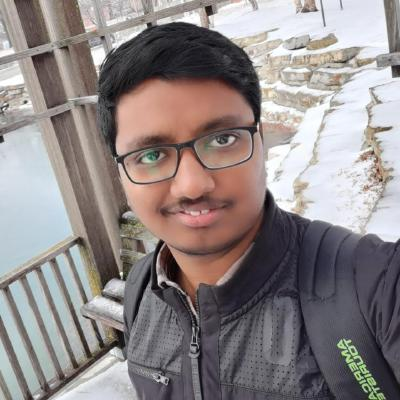

# big-data-developer

# Preferred Name: Rohith

## Current
- I am in the final semester of my Master's degree in Applied Computer Science. I am also working as a Teaching Assistant(TA) in the Computer Science Department.

## Background
- I have did my undergraduation in Computer Science and Engineering from Sreyas Institute of Engineering and Technology, JNTUH with an aggregate of 66%.
- I have did my Intermediate from Sri Gayatri Junior College, Hyderabad.
- My hobbies are watching cricket, playing mobile games, browsing the internet.

## Plans
- I am interested in the programming side so I want to be a Full-Stack developer or Java developer. Where I can develop and utilize my skills and grow further.

## Links

- LinkedIn: https://www.linkedin.com/in/rohith-chittimalla-227605155/
- GitHub: https://github.com/rohith0696

